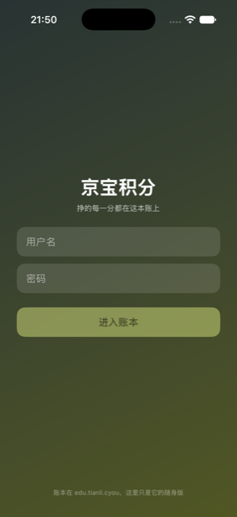
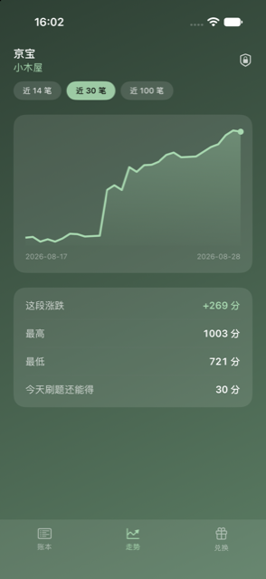
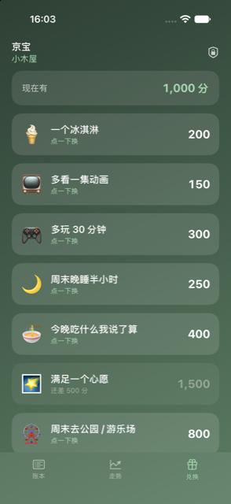
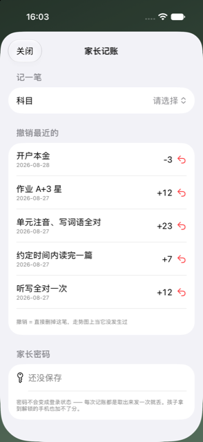
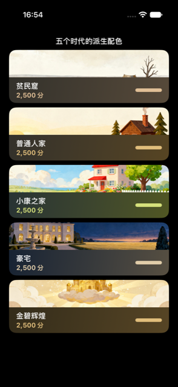
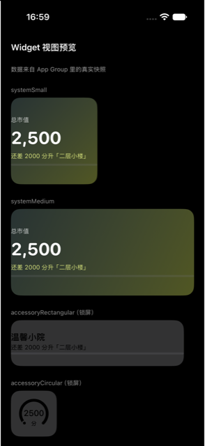

<p align="center"></p>

# 成长小金库 · points-deck

**孩子的每一分努力，涨成看得见的房子。**

    

给孩子做的：11 档市值映射 5 个时代的插画，「住什么房看得见」，整页配色从插画采样派生。家长密码永不落盘——能自己给自己加分的积分系统，第二天就会变成刷分游戏。升档只庆不罚，回落一声不吭。

<table><tr>
<td align="center" width="25%"><br><sub>开屏：挣的每一分都在这本账上——整页配色跟着当前住的房子走</sub></td>
<td align="center" width="25%"><br><sub>走势：积分市值像股票一样有曲线，最高最低、今天刷题还能得几分</sub></td>
<td align="center" width="25%"><br><sub>兑换：冰淇淋、多玩 30 分钟、满足一个心愿——花自己挣的分，不许透支</sub></td>
<td align="center" width="25%"><br><sub>家长记一笔：选规则、看预览、输密码；撤销最近的直接删，走势图上当它没发生过</sub></td>
</tr></table>

<details><summary>更多截图</summary><table><tr>
<td align="center" width="25%"><br><sub>五个时代的插画与从中采样派生的整页配色</sub></td>
<td align="center" width="25%"><br><sub>Widget 视图预览（App 内渲染）：市值常驻，还差多少升下一档</sub></td>
</tr></table></details>

## 它做什么

| 功能 | 说明 |
|---|---|
| **努力涨成看得见的房子** | 11 档市值映射 5 个时代的插画，从贫民窟到金碧辉煌。整页配色从当前那张插画采样派生——升档换房，整个 app 跟着换气质。升档只庆不罚，回落一声不吭。 |
| **像股票盘面一样看自己的账** | 走势、涨跌、最高最低——账本长成孩子看得懂又觉得酷的样子。余额用每条流水自带的快照，端上不自己累加，两边永远对得上。 |
| **家长密码永不落盘** | 能自己给自己加分的积分系统，第二天就会变成刷分游戏。所以家长密码每次现输、只在内存、切后台就没了——孩子拿到解锁的手机也加不了分。分值一律服务端算，客户端连一个加号都没有。 |

## 怎么拿到

已支持邮箱注册与独立家庭账本；iOS 版正在准备 App Store 发布，暂未开放公开下载。

时代插画底图来自作者的 `~/Edu` 内容库（构建时同步进包），账本后端 `edu.tianli.cyou`。没有那份内容库，构建会停在 preBuildScripts。

## 构建

```bash
brew install xcodegen
xcodegen generate
xcodebuild -scheme PointsDeck -destination 'generic/platform=iOS Simulator' build
```

- 仓里的 `*.sh` 是作者本机舰队脚本的 shim（三平台构建 / 真机装机 / TestFlight），依赖 `~/Dev` 下的总部工具，不在本仓；没有那套工具时它们会明确退出。
- `Shared/PlatformCompat.swift` 是总部共享文件的逐字节副本（iOS-only SwiftUI 修饰符在 macOS 侧的同名 no-op），别在这里改它。
- `project.yml` 的 preBuildScripts 会跑 `sync-skins.sh`，从作者本机同步内容进包；没有那份内容时构建会停在这一步。

开发细节（回归、验证通道、约束）见 [DEVELOPING.md](DEVELOPING.md)。

## 相关

- 产品页：<https://apps.tianli.cyou/p/points-deck-ios.html>
- 舰队总览（10 个 app 怎么来的）：<https://apps.tianli.cyou/ios.html>
- 教程：[从零到 TestFlight：一个人做 iPhone app 的完整路径](https://blog-ai.tianli.cyou/nine-ios-apps-in-two-weeks)

## License

MIT © 2026 曾田力 (Tianli Zeng)
